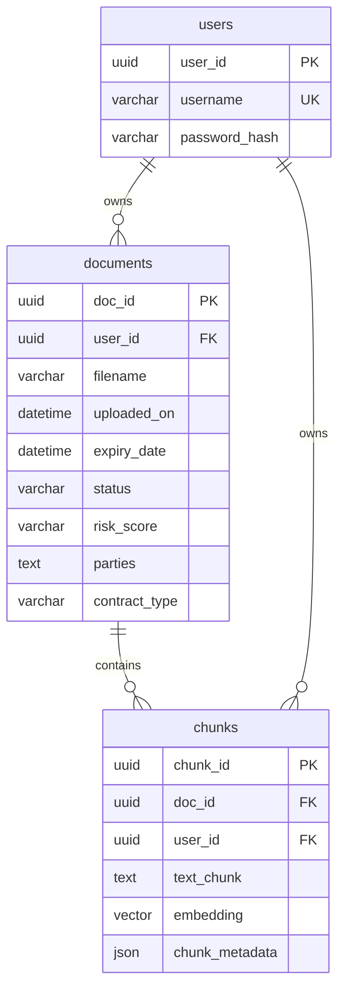

# ContractHub Database Schema

## Entity Relationship Diagram



## Table Specifications

### users
The users table stores authentication and basic user information for multi-tenant isolation.

| Column | Type | Constraints | Description |
|--------|------|-------------|-------------|
| user_id | UUID | PRIMARY KEY, DEFAULT uuid_v4() | Unique identifier for each user |
| username | VARCHAR(255) | UNIQUE, NOT NULL, INDEX | User's login username |
| password_hash | VARCHAR(255) | NOT NULL | Bcrypt hashed password |

### documents
The documents table stores contract metadata and information.

| Column | Type | Constraints | Description |
|--------|------|-------------|-------------|
| doc_id | UUID | PRIMARY KEY, DEFAULT uuid_v4() | Unique identifier for each document |
| user_id | UUID | FOREIGN KEY REFERENCES users(user_id) ON DELETE CASCADE, INDEX | Owner of the document |
| filename | VARCHAR(512) | NOT NULL | Original filename of uploaded document |
| uploaded_on | DATETIME | NOT NULL, DEFAULT NOW() | Timestamp when document was uploaded |
| expiry_date | DATETIME | NULLABLE | Contract expiration date |
| status | VARCHAR(32) | NOT NULL, DEFAULT 'Active' | Contract status (Active, Expired, Renewal Due) |
| risk_score | VARCHAR(16) | NOT NULL, DEFAULT 'Low' | Risk assessment (Low, Medium, High) |
| parties | TEXT | NULLABLE | Contract parties involved |
| contract_type | VARCHAR(100) | NULLABLE | Type of contract (MSA, NDA, etc.) |

### chunks
The chunks table stores document content chunks with vector embeddings for semantic search.

| Column | Type | Constraints | Description |
|--------|------|-------------|-------------|
| chunk_id | UUID | PRIMARY KEY, DEFAULT uuid_v4() | Unique identifier for each chunk |
| doc_id | UUID | FOREIGN KEY REFERENCES documents(doc_id) ON DELETE CASCADE, INDEX | Parent document |
| user_id | UUID | FOREIGN KEY REFERENCES users(user_id) ON DELETE CASCADE, INDEX | Owner for multi-tenant isolation |
| text_chunk | TEXT | NOT NULL | Extracted text content |
| embedding | VECTOR(4) | NOT NULL | Vector embedding for semantic search (using pgvector) |
| chunk_metadata | JSON | NOT NULL, DEFAULT '{}' | Additional metadata (page, confidence, clause_type) |

## Indexes

### Primary Indexes
- `users.user_id` (Primary Key)
- `documents.doc_id` (Primary Key)  
- `chunks.chunk_id` (Primary Key)

### Foreign Key Indexes
- `documents.user_id` (for user-document relationships)
- `chunks.doc_id` (for document-chunk relationships)
- `chunks.user_id` (for user-chunk relationships)

### Specialized Indexes
- `users.username` (Unique index for login queries)
- `chunks.embedding` (pgvector HNSW index for similarity search)

## Multi-Tenancy

The schema implements multi-tenancy through the `user_id` column:
- All documents are isolated by `user_id`
- All chunks are isolated by `user_id` 
- All queries filter by the authenticated user's `user_id`
- Cascading deletes ensure data consistency

## Vector Search

The `chunks.embedding` column uses pgvector extension:
- Stores 4-dimensional vectors (demo/mock embeddings)
- Supports cosine similarity search using `<=>` operator
- HNSW index for efficient similarity queries
- Production would use 384+ dimensional embeddings

## Security Features

1. **Authentication**: JWT tokens with user_id claims
2. **Authorization**: All operations scoped to authenticated user
3. **Data Isolation**: Foreign key constraints with CASCADE DELETE
4. **Password Security**: Bcrypt hashing with salt

## Sample Queries

### Find contracts for user
```sql
SELECT * FROM documents 
WHERE user_id = ? 
ORDER BY uploaded_on DESC;
```

### Vector similarity search
```sql
SELECT chunk_id, text_chunk, 1 - (embedding <=> ?) as relevance
FROM chunks 
WHERE user_id = ?
ORDER BY embedding <=> ?
LIMIT 5;
```

### Contract with risk analysis
```sql
SELECT d.*, COUNT(c.chunk_id) as chunk_count
FROM documents d
LEFT JOIN chunks c ON d.doc_id = c.doc_id
WHERE d.user_id = ? AND d.risk_score = 'High'
GROUP BY d.doc_id;
```